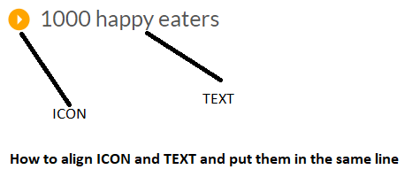

## Align ICON and TEXT in the same line.

Refer the image below



```

<div class="city-feature">
  <i class="ion-ios-star icon-small"></i>
  60+ top chefs
</div>

.icon-small {

 display: inline-block;
 width: 30px;
 text-align: center;
 color: #e67e22;
 font-size: 120%;
 margin-right: 10px;
 
/*secrets to align text and icons */
 line-height: 120%;
 vertical-align: middle;
 margin-top: -5px;
}

```

