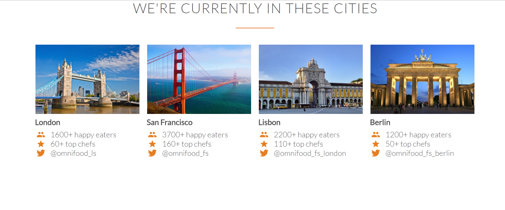

```
<section>
        <div class="row">
            <h2>WE'RE CURRENTLY IN THESE CITIES</h2>            
        </div>
       
        <div class="row">
            
            <!------------COLUMN 1 -------------->
            <div class="col span-1-of-4 box">
                
                <h4>London</h4>                
                <div><ion-icon name="people"></ion-icon>1600+ happy eaters</div>
                <div><ion-icon name="star"></ion-icon>60+ top chefs</div>
                <div><ion-icon name="logo-twitter"></ion-icon>@omnifood_ls</div>            
            </div>
            
            <!------------COLUMN 2 -------------->
            <div class="col span-1-of-4 box">
                
                <h4>San Francisco</h4>                
                <div><ion-icon name="people"></ion-icon>3700+ happy eaters</div>
                <div><ion-icon name="star"></ion-icon>160+ top chefs</div>
                <div><ion-icon name="logo-twitter"></ion-icon>@omnifood_fs</div>            
            </div>
            
            <!------------COLUMN 3 -------------->
            <div class="col span-1-of-4 box">
                
                <h4>Lisbon</h4>                
                <div><ion-icon name="people"></ion-icon>2200+ happy eaters</div>
                <div><ion-icon name="star"></ion-icon>110+ top chefs</div>
                <div><ion-icon name="logo-twitter"></ion-icon>@omnifood_fs_london</div>            
            </div>
            
            <!------------COLUMN 4 -------------->
            <div class="col span-1-of-4 box">
                
                <h4>Berlin</h4>                
                <div><ion-icon name="people"></ion-icon>1200+ happy eaters</div>
                <div><ion-icon name="star"></ion-icon>50+ top chefs</div>
                <div><ion-icon name="logo-twitter"></ion-icon>@omnifood_fs_berlin</div>                  
            </div>
        </div>

    
   </section>
```

```
* {
    margin: 0;
    padding: 0;
    box-sizing: border-box;
}

 html {
  background-color: #fff;
  color: #555;
  font-family: 'Lato', 'Arial', sans-serif;
  font-weight: 300;
  font-size: 20px;
  text-rendering: optimizeLegibility;  
 }
 
 .row {
  max-width: 1140px;
  margin: 0 auto;
}
 
.col img{
    height: 180px;
    width:auto;
    margin: 1px;
}

.col h4{
    margin-top:5px;
    margin-bottom: 10px;    
}

ion-icon{
    display: inline-block;
 width: 30px;
 text-align: center;
 color: #e67e22;
 font-size: 120%;
 margin-right: 10px;
 
/*secrets to align text and icons */
 line-height: 120%;
 vertical-align: middle;
 margin-top: -5px;
}

h2 {
  font-weight: 300;
  text-transform: uppercase;
  letter-spacing: 1px;
  font-size: 180%;
  word-spacing: 2px;
  text-align: center;
  margin-bottom: 30px;
}

h2:after {
   display:block;
   height: 2px;
   background-color: #e67322;
   content: " "; 
   width: 100px;
   margin: 0 auto; 
   margin-top: 30px; 
}
```
