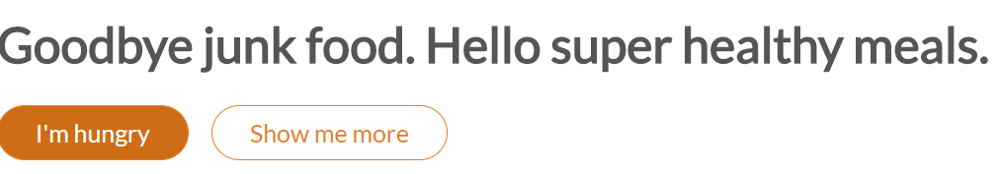

### Designing the buttons



Now to design the buttons let us add a css class like this. You can also copy and paste the below code if required. All buttons are designed more or less the same way.

```
<header>	
   <div class="hero-text-box">       
       <h1>Goodbye junk food. Hello super healthy meals.</h1>
       <a class="btn btn-full" href="#">I'm hungry</a> 
       <a class="btn btn-ghost" href="#">Show me more</a>
   </div>

</header>
```

This is the common button style for any buttons

Note: Link is the default state so hence we are changing .btn to .btn:link

```
.btn:link {
   display: inline-block;
   padding: 10px 30px;
   font-weight: 300px;
   text-decoration: none; //this is used to remove underline from <a> tag
   border-radius: 200px; // to get a curved button on all borders
   
}
```

```
.btn-full{
	background-color: #e67e22; //get the color code from flatuicolors.com
	border: 1px solid #e67e22;
	color: #fff -> // to change the text color on the button to white
}
```

```  
.btn-ghost{
   border: 1px solid #e67e22;
   color: #e67e22;
}

```

Every button has four states also called as pseudo states. They are as follows

* Link - Link is the default state
* Visited
* active - When we click on a button
* hover - When we put mouse on a button

 ### Link and Visited:

Here both link and visited has the same style. So you can use the below code

  #### Writing for link and visited

```
.btn:link,
.btn:visited {
   display: inline-block;
   padding: 10px 30px;
   font-weight: 300px;
   text-decoration: none; //this is used to remove underline from <a> tag
   border-radius: 200px; // to get a curved button on all borders
   transition: background-color 0.2s, border 0.2s, color 0.2s // this will create an animation effect to the button and change the background-color, border and font-color slowly
}
```


```
.btn-full:link,
.btn-full:visited{
	background-color: #e67e22; //get the color code from flatuicolors.com
	border: 1px solid #e67e22;
	color: #fff -> // to change the text color or font color on the button to white
	margin-right: 15px;
}
```

```  
.btn-ghost:link,
.btn-ghost:visited{
   border: 1px solid #e67e22;
   color: #e67e22; // to change the text color or font color
}

```

 #### Writing for hover and active

```
.btn:hover,
.btn:active {
	background-color: #cf6d17; //get a darker shade of original button color. Use the 0-255 color tool here
}

```

```
.btn-full:hover,
.btn-full:active{
	border: 1px solid #e67e22;
}
```

```  
.btn-ghost:hover,
.btn-ghost:active{
   border: 1px solid #e67e22;
   color: #fff; // to change the text color or font color
}

```
