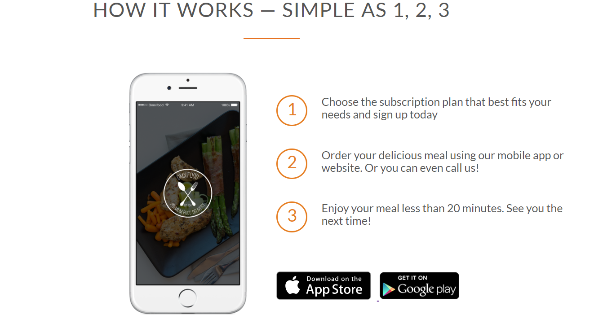

/* -------------------------- HTML SECTION -------------------------------- */

```
<!DOCTYPE html>
<html>
<head>
  <title></title>
  <link rel="stylesheet" type="text/css" href="grid.css">
  <link rel="stylesheet" type="text/css" href="https://necolas.github.io/normalize.css/8.0.0/normalize.css">
<link rel="stylesheet" type="text/css" href="style.css">
  
</head>
<body>

  <section class="section-steps">
   <div class="row">
       <h2>How it works &mdash; Simple as 1, 2, 3</h2>
   </div>

  <div class="row">
    <div class="col span-1-of-2 steps-box">
           
  </div>

  <div class="col span-1-of-2 steps-box">
      <div class="works-step">
             <div>1</div>
             <p>Choose the subscription plan that best fits your needs and sign up today</p>
      </div>
        
      <div class="works-step">
             <div>2</div>
             <p>Order your delicious meal using our mobile app or website. Or you can even call us!</p>
      </div>

      <div class="works-step">
             <div>3</div>
             <p>Enjoy your meal less than 20 minutes. See you the next time!</p>
      </div>

      <a href="#" class="btn-app"> </a>
      <a href="#" class="btn-app"> </a>
      
  </div>
 </div> 
</section>

</body>
</html>
```

---

/*-----------------------------CSS SECTION -------------------------------- */

```

* {
    margin: 0;
    padding: 0;
    box-sizing: border-box;
 }


 html {
  background-color: #fff;
  color: #555;
  font-family: 'Lato', 'Arial', sans-serif;
  font-weight: 300;
  font-size: 20px;
  text-rendering: optimizeLegibility;  //using this is a good practise
 }

 .row {
  max-width: 1140px;
  margin: 0 auto;
}

h2 {
  font-weight: 300;
  text-transform: uppercase;
  letter-spacing: 1px;
  font-size: 180%;
  word-spacing: 2px;
  text-align: center;
  margin-bottom: 30px;
}

 h2:after {
   display:block;
   height: 2px;
   background-color: #e67322;
   content: " "; // this is mandatory. It refers to what content should be put
   width: 100px;
   margin: 0 auto; //to center the line
   margin-top: 30px; //margin between the h2 tag and the small line
}


/* ------ this code moves the mobile image to the right side --- */
.steps-box:first-child{
    text-align: right;
    padding-right: 3%;
    margin-top: 30px;
}

/* -------------last child is the right side content ------*/

.steps-box:last-child{
    margin-top:70px;
    padding-right: 3%;
}

/* this code reduces the mobile image size to 40% */
.app-screen {
    width:40%;    
}

.works-step{
    margin-bottom: 50px;
}

.works-step div{
    color: #e67e22;
    border: 2px solid #e67e22;
    display: inline-block;
    border-radius: 50%;
    height: 55px;
    width: 55px;
    text-align: center;
    padding: 5px;
    float: left;
    font-size: 150%;
    margin-right: 25px;
}

/********** The :last-of-type selector allows you to target the last occurence of an element within its container ************/

.works-step:last-of-type{
    margin-bottom: 80px;
}

.btn-app img{
    height:50px;
    width:auto;
    margin-right: 10px;
    
}


```
