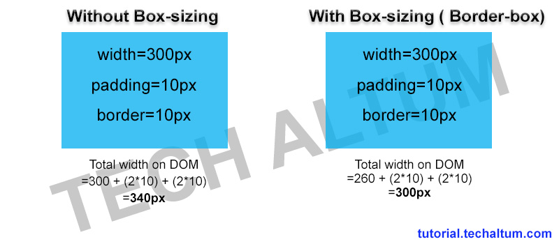
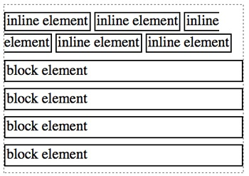
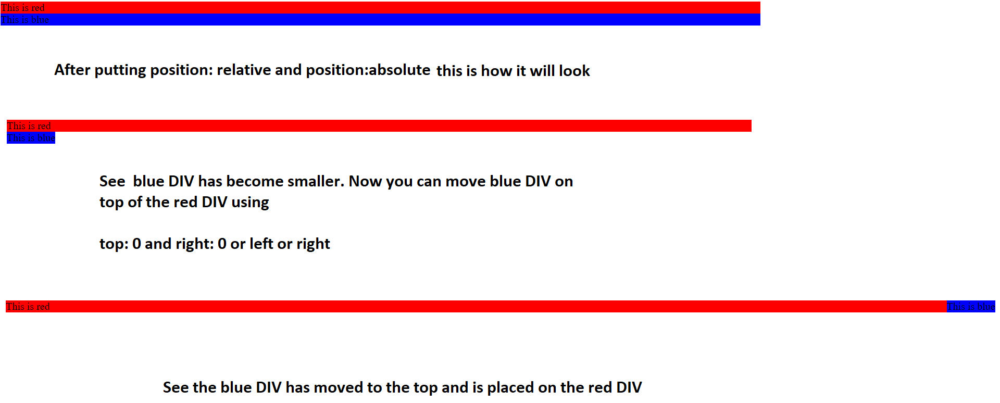

## Remove default margins 

All browsers set default margins for HTML elements if we dont specify any. To remove the default margins use the below code

```
* {
    margin: 0;
    padding: 0;
    box-sizing: border-box;
}
```

## What is box sizing?



---

## Block Elements and Inline Elements

In HTML there are block elements and inline elements

```
<h1> and <p> tags are examples of block elements. 

 <a href>, <strong> and <em> are examples of inline elements. 

```

You cannot set height and width for inline elements.

Block elements are stacked vertically one after another.

Inline elements are stacked vertically one aside another. 



---

##  Using the container.

Put all the elements inside a container and set the container like this

Steps:

   
   2. Make the container centered 

```
.container {
  Step 1: Set width of the container
   width: 1140px;
  Step 2: Make the DIV centered. auto means that the left and right margin are adjusted automatically according to the context of the           element which is the browser window. So if you adjust the browser window the content stays centered.
   margin-left: auto;  
   margin-right: auto;
}
```


---

## Understanding the float and clearfix property


After giving float:left then it would look like this but see the yellow box also has moved to the right side. 


To resolve such issue use clearfix property shown below


```
  .clearfix:after {
   content: "",
   display: table;
   clear: both;
}

```

---

## Working with Images

When you put an image use the below css. auto is used to maintain the aspect ratio of the image

```
img{
   height: 150px;
   width: auto;
}
```

---
 
## Postion: absolute and position: relative



``` 	     
.red{
	background-color: red;
	position: relative; //put relative for the parent DIV
}

.blue{
    background-color: blue;
    position: absolute; //put absolute for the child DIV
    top:0;
    right:0;
}
 


     <div class ="red">

            This is red
    
         <div class = "blue" > This is blue</div>
   
     </div>

```

---

## Typography - Fonts and Line Spacing

### Rules:

1. Use a font size of 15px - 25px for body text

2. For headlines you can use a font size of 60px

Note: When you increase the font size always decrease the font weight of the text. This ensures that the text doesn't steal too much attention from the rest of the content and it makes the text look less bulky.

3. For sub-headlines you can use a font size of 32px

4. Use a line spacing of 120% and 150% of the font size. So if the font size is 15px use a line spacing of 15*120% = 18px


### Fonts

1. You can either use sans-serif fonts or serif fonts
  
   **Some very good sans-serif fonts**

  * Open Sans
  * Lato
  * Raleway
  * Monsterrat
  * PT sans

  **Some very good serif fonts**

  * Cardo
  * Merriweather
  * PT Serif

  You can also mix sans-serif fonts for body and serif fonts for heading

---

## Color combination in Web Design

To choose a color for your website first go to the website below

https://flatuicolors.com and choose any base color

then go the below website

http://www.0to255.com and enter the base color. The above website will create various variations of the base color. Choose any of the five variation and create a color palette to use in your website.

For background colors and text colors, use grey colors

### Mix and match Colors:

If you want to mix and match different base colors then you can use the tool below. It will recommend different colors which will look nice

For information on how to use the color wheel you can check the below YouTube video

https://color.adobe.com/create/color-wheel/

<a href="http://www.youtube.com/watch?feature=player_embedded&v=fuF3foDjHwc" target="_blank"></a>

They also have a set of color schmes i.e a set of color sets which are to be used in combination. Find the link below

https://color.adobe.com/explore/?filter=most-popular&time=month 

Note: 
  
   * Use the main color to draw attention to your   website like "Call to action button" or any other important element of your website

   * Use the second and third color to compliment the main color

   * Never use black in your design
   
 ---
 
 ## Putting text over images

If you put text directly on an image it will only look good if the image is dark and text is white. 

There are few techniques for making the image and text look good.

1. Overlay the image with a color. The most easiest to use is a black overlay on the top of image and then write text on it. Apart from black you can also use various other color gradients.

2. The second option is to blur the image and the text is shown on the blurred image part on all screen resolutions

3. The third option is to use a technique called "Floor fade technique". Here the image subtly fades towards black at the bottom and white text written over it.

4. Simply putting text on a box like the image shown below. The box should be opaque so that you can still see the image beneath it. In the below case a white color with some transperancy is used. 


---
 
## Including normalize.css

Normalize.css makes browsers render all elements more consistently and in line with modern standards. Include this file before adding any css file

```
<link rel="stylesheet" type="text/css" href="normalize.css">
```

---

## Including Web fonts

  #### Check the Fonts section to find what fonts to use

Link to download fonts: http://google.com/fonts

Quick Introduction on how to use Google fonts. Check the below video

[](http://www.youtube.com/watch?v=67AbASjp0co)

You can always set the default font like this

```
html {
font-family: 'Lato', 'Arial', sans-serif;
font-weight: 300;
text-rendering: optimizeLegibility;  //using this is a good practise
}

```

---

## Fluid Grid

We will be using fluid grid to develop our website. The fluid grid that we would be using is 

http://www.responsivegridsystem.com/

Inlcude the above grid.css after normalize.css

```
<link rel="stylesheet" type="text/css" href="grid.css">
```

Note: The downloaded file will have seperate file as 2cols.css, 3cols.css. Combine everything into one and rename it as grid.css and include it here

Using this grid all our content will be in columns. You can have from 1 column in a row to 12 columns in a row.

When using this grid we will be using only one value in px and rest we would be using in percentages

```
 .row{
 	max-width: 1140px;
 	margin-left: auto;
 	margin-right: auto;
 }

```

---

## Elements in HTML

HTML 5 has elements like 

| HTML Elements       |   STRUCTURE           | 
| ------------- |:-------------:| 
| ```<article>```     |   |
 ```<aside>```                      
 ```<details>```                   
 ```<figcaption>```                 
 ```<figure>```                     
 ```<footer>```                     
 ```<header>```                     
 ```<main>```                       
 ```<mark>```                       
 ```<nav>```                       
 ```<section>```                    
 ```<summary>```                    
 ```<time>```                      
