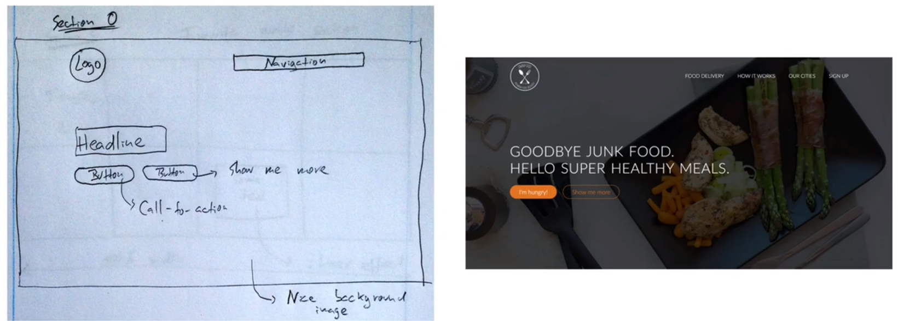
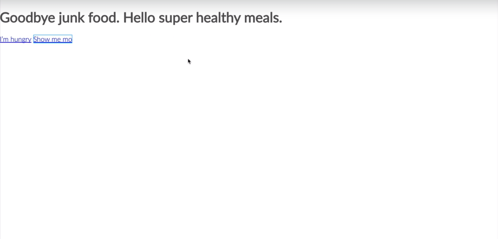
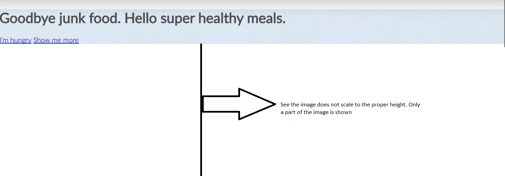
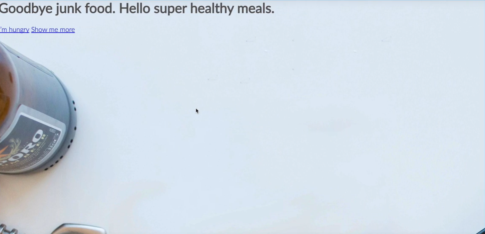
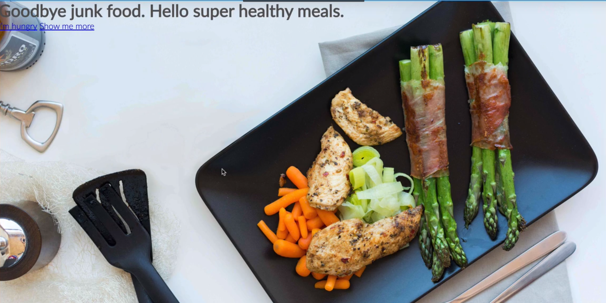
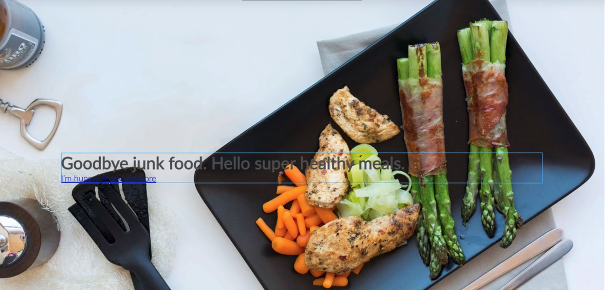
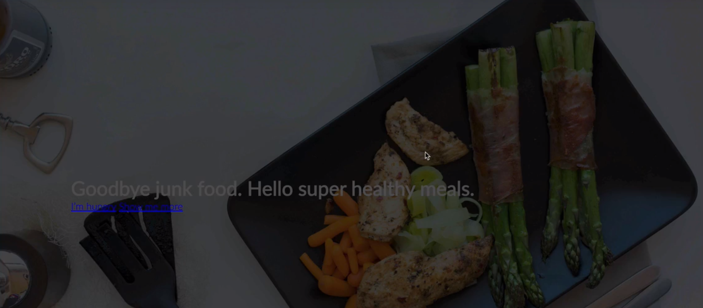

## Working with Images

When you put an image use the below css. auto is used to maintain the aspect ratio of the image

```
img{
   height: 150px;
   width: auto;
}
```

---
 
## Putting text over images

If you put text directly on an image it will only look good if the image is dark and text is white. 

There are few techniques for making the image and text look good.

1. Overlay the image with a color. The most easiest to use is a black overlay on the top of image and then write text on it. Apart from black you can also use various other color gradients.

2. The second option is to blur the image and the text is shown on the blurred image part on all screen resolutions

3. The third option is to use a technique called "Floor fade technique". Here the image subtly fades towards black at the bottom and white text written over it.

4. Simply putting text on a box like the image shown below. The box should be opaque so that you can still see the image beneath it. In the below case a white color with some transperancy is used. 


---
 
## Including normalize.css

Normalize.css makes browsers render all elements more consistently and in line with modern standards. Include this file before adding any css file

```
<link rel="stylesheet" type="text/css" href="normalize.css">
```

---


## Fluid Grid

We will be using fluid grid to develop our website. The fluid grid that we would be using is 

http://www.responsivegridsystem.com/

Inlcude the above grid.css after normalize.css

```
<link rel="stylesheet" type="text/css" href="grid.css">
```

Note: The downloaded file will have seperate file as 2cols.css, 3cols.css. Combine everything into one and rename it as grid.css and include it here

Using this grid all our content will be in columns. You can have from 1 column in a row to 12 columns in a row.

When using this grid we will be using only one value in px and rest we would be using in percentages

```
 .row{
 	max-width: 1140px;
 	margin-left: auto;
 	margin-right: auto;
 }

```

---

## Elements in HTML


  ```
  <article>        
     <aside>                       
     <details>                   
     <figcaption>                 
     <figure>                     
     <footer>                     
     <header>                     
     <main>                       
     <mark>                       
     <nav>                       
     <section>                    
     <summary>                    
     <time>
   
   ```   
---

## Building the header part

  ### Final output:

  We will be creating the below output.

  * Placing image in the header section
  * Placing main text on the image
  * Placing 2 buttons on the image
  * Placing navigation on the image 

  ### Result:
  
  
  
  ### STEP 1: ```<header>``` tag

 We will put everything inside ```<header>``` DIV

```
<header> 

</header>
```


### STEP 2: Container

 Now we will create a container inside the ```<header>``` tag

```
<header>

  <div class="hero-text-box">
  	
  </div>

</header>
```

### STEP 3: H1 tag

 Now we will put ```<h1>``` inside the container

```
<header>
	
	<div class="hero-text-box">
       
          <h1>Goodbye junk food. Hello super healthy meals.</h1>
 
	</div>

</header>
```

### STEP 4: BUTTONS

 Now we need two buttons inside the container. For buttons we will use ```<a href>``` tag

```
 <header>	
   <div class="hero-text-box">       
       <h1>Goodbye junk food. Hello super healthy meals.</h1>
       <a href="#">I'm hungry</a> 
       <a href="#">Show me more</a>
   </div>

</header>
```

Result: 

  

### STEP 5: Add default styles

  * Add *{}, html{} default for all CSS

```
 * {
    margin: 0;
    padding: 0;
    box-sizing: border-box;
 }
``` 

```
 html {
 	background-color: #fff;
 	color: #555;
	font-family: 'Lato', 'Arial', sans-serif;
	font-weight: 300;
	font-size: 20px;
	text-rendering: optimizeLegibility;  //using this is a good practise
 }
```

### STEP 6: background-image

```
header{
	background-image: url(hero.jpg);
}
```

### STEP 7: Image Height

When you set a background image the image only fills the part which has some content like shown below



To scale the image to whole view port

```
header{
	background-image: url(hero.jpg);
	height: 100vh; //means 100% of the view port
}
```

Now the image would have scaled like this



### STEP 8: image background-size

Even now if you see the image would be like zoomed in and part of the image will not be visible. See the image below


So resolve this we will have to give background-size

```
header{
	background-image: url(hero.jpg);
	background-size:cover;
	height: 100vh; //means 100% of the view port
}
```
### STEP 9: background-centered

Then you will have to make background centered

```
header{
	background-image: url(hero.jpg);
	background-size:cover;
	background-position: center;
	height: 100vh; //means 100% of the view port
}

```

Now the image will look like this



So now even if you resize the browser window the whole image would scale down and be properly shown in the screen.

### Working with Text on images

Now lets see how to place text on images properly

```
 <header>
	
	<div class="hero-text-box">
       
       <h1>Goodbye junk food. Hello super healthy meals.</h1>
       <a href="#">I'm hungry</a> 
       <a href="#">Show me more</a>
	</div>

</header>
```

Always give width for the textbox. 
Then if you want to move the textbox DIV give ```position:absolute``` along with ```top:0``` or ```left:0``` or ```right:0``` or ```bottom:0```

It is also a good practise to give ```transform: translate(-50%, -50%)``` along with ```position:absolute``` and ```top/left/right/bottom```. ```transform:translate``` has better performance than using ```top/left/right/bottom```

```
.hero-text-box {
   position: absolute;
   width: 1140px;
   top:50%;
   left:50%;
   transform: translate(-50%, -50%);
}

```

Now the text would be nicely centered and it will look like this.



### Setting Contrast 

Now if you see the above image text on the image does not look good. As mentioned in the earlier chapter to make text look good on images one way is to put a black transparent background on the image and put a white color text on it.

 #### Adding gradient:

Now we have already learned from the earlier chapter image on text will look good only if the image is transparent or out-of-focus etc and text should be white. So now lets add a transparent overlay on top of the image like this.

```
header{
	background-image: linear-gradient(rgba(0,0,0,0.7), rgba(0,0,0,0.7)), url(hero.jpg);
	background-size:cover;
	background-position: center;
	height: 100vh; //means 100% of the view port
}
```

Now this will look like this



  #### Making changes to the font
  
   ```
      h1{
          color: #fff;
	  font-size: 200%  // Refer what are good font sizes for heading in the earlier chapters.
      }
   
   ```

   #### So how 200%?
   
    In responsive design eveything should be mentioned in percentages and only in the global scope we should mention pixels. So the global scope is the below code
    
    ```
     html {
 	background-color: #fff;
 	color: #555;
	font-family: 'Lato', 'Arial', sans-serif;
	font-weight: 300;
	font-size: 20px;
	text-rendering: optimizeLegibility;  //using this is a good practise
     }
    
    ```
    
    So when you say font-size:200% it refers to 200% of font-size:20px
    
  #### Decrease the font weight
  
Now remember as in the earlier chapters when the font-size is big decrease the font-weight. Usually ```<h1>``` tag comes with bold formatting.
   
```
      h1{
          color: #fff;
	  font-size: 200%  // Refer what are good font sizes for heading in the earlier chapters.
	  font-weight: 300;
      }
   
```
   
   Other things that you can do to make ```<h1>``` look better
   
```
      h1{
          color: #fff;
	  font-size: 200%  // Refer what are good font sizes for heading in the earlier chapters.
	  font-weight: 300;
	  text-transform: uppercase;
	  letter-spacing: 1px;  // so the letters don't look very compressed
	  word-spacing: 3px; //letters between words
      }
   
```
  
### Designing the buttons

Now to design the buttons let us add a css class like this. You can also copy and paste the below code if required. All buttons are designed more or less the same way.

```
<header>	
   <div class="hero-text-box">       
       <h1>Goodbye junk food. Hello super healthy meals.</h1>
       <a class="btn btn-full" href="#">I'm hungry</a> 
       <a class="btn btn-ghost" href="#">Show me more</a>
   </div>

</header>
```

This is the common button style for any buttons

Note: Link is the default state so hence we are changing .btn to .btn:link

```
.btn:link {
   display: inline-block;
   padding: 10px 30px;
   font-weight: 300px;
   text-decoration: none; //this is used to remove underline from <a> tag
   border-radius: 200px; // to get a curved button on all borders
   
}
```

```
.btn-full{
	background-color: #e67e22; //get the color code from flatuicolors.com
	border: 1px solid #e67e22;
	color: #fff -> // to change the text color on the button to white
}
```

```  
.btn-ghost{
   border: 1px solid #e67e22;
   color: #e67e22;
}

```

Every button has four states also called as pseudo states. They are as follows

* Link - Link is the default state
* Visited
* active - When we click on a button
* hover - When we put mouse on a button

 ### Link and Visited:

Here both link and visited has the same style. So you can use the below code

  #### Writing for link and visited

```
.btn:link,
.btn:visited {
   display: inline-block;
   padding: 10px 30px;
   font-weight: 300px;
   text-decoration: none; //this is used to remove underline from <a> tag
   border-radius: 200px; // to get a curved button on all borders
   transition: background-color 0.2s, border 0.2s, color 0.2s // this will create an animation effect to the button and change the background-color, border and font-color slowly
}
```


```
.btn-full:link,
.btn-full:visited{
	background-color: #e67e22; //get the color code from flatuicolors.com
	border: 1px solid #e67e22;
	color: #fff -> // to change the text color or font color on the button to white
	margin-right: 15px;
}
```

```  
.btn-ghost:link,
.btn-ghost:visited{
   border: 1px solid #e67e22;
   color: #e67e22; // to change the text color or font color
}

```

 #### Writing for hover and active

```
.btn:hover,
.btn:active {
	background-color: #cf6d17; //get a darker shade of original button color. Use the 0-255 color tool here
}

```

```
.btn-full:hover,
.btn-full:active{
	border: 1px solid #e67e22;
}
```

```  
.btn-ghost:hover,
.btn-ghost:active{
   border: 1px solid #e67e22;
   color: #fff; // to change the text color or font color
}

```
