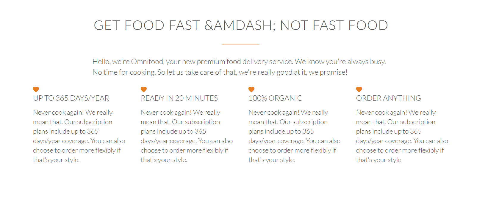

## Designing the Features Section

What are we going to build?

Output: 

Now the header part is over

<header> 
  
  ...//code here
  
</header>

HTML has an element called section. 

Now lets design the HTML for the above layout

We also use icons from http://ionicons.com. To use ionicons download ionicons.min.css and include it in css folder.Also download icon fonts of ionicons.

<section class="section-features">
 

    <h2>Get food fast &amdash; not fast food </h2>
    
Hello, we're Omnifood, your new premium food delivery service. We know you're always busy. No time for cooking. So let us take care of that, we're really good at it, we promise!
    

 

 

   <!-- refer grid.css, col and span-1-of-4 are set in those files -->
   <!-- column 1 -->
    

      <i class="ion-heart"></i>
      <h3>Up to 365 days/year</h3>
      
Never cook again! We really mean that. Our subscription plans include up to 365 days/year coverage. You can also choose to order more flexibly if that's your style. 
      
      
    

      
     <!-- column 2 --> 

    

      <i class="alarm"></i>
      <h3>Ready in 20 minutes</h3>
      
Never cook again! We really mean that. Our subscription plans include up to 365 days/year coverage. You can also choose to order more flexibly if that's your style. 
      
      
    

     <!-- column 3 -->

     

      <i class="build"></i>
      <h3>100% organic</h3>
      
Never cook again! We really mean that. Our subscription plans include up to 365 days/year coverage. You can also choose to order more flexibly if that's your style. 
      
      
    

    <!-- column 4 -->

    

      <i class="copy"></i>
      <h3>Order anything</h3>
      
Never cook again! We really mean that. Our subscription plans include up to 365 days/year coverage. You can also choose to order more flexibly if that's your style. 
      
      
    

 

</section>
